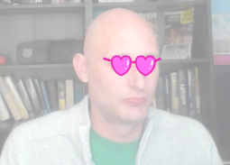

## Cum să schimbi costumele

--- task ---

Acum că ai ochelarii poziționați, poți utiliza câteva apăsări simple pentru a le schimba stilul. Adaugă aceste blocuri de cod personajului tău.

```blocks3
când tasta [săgeată dreapta v] este apăsată
costumul următor
```

--- /task ---

--- task ---

Încearcă să apeși tasta săgeată dreaptă de pe tastatură pentru a vedea ochelarii schimbându-și stilul.



--- /task ---

--- task ---

S-ar putea să vreisă te întorci la un costum anterior folosind tasta săgeată stânga. Pentru a face acest lucru, trebuie să utilizezi `numărul costumului`{:class="block3looks"} și să scazi `1` din el.

```blocks3
when [left arrow v] key pressed
switch costume to ((costume [number v]) - (1))
```

--- /task ---

--- task ---

Pentru a adăuga alte costume la personaj, dă click pe fila **Costume** și apoi pe butonul **Alege un costum** din colțul din stânga jos al ecranului.


--- /task ---

--- task ---

În fila **Costume**, poți selecta toate părțile unui costum ținând apăsată tasta Ctrl de pe tastatură și apoi apăsând tasta literă A. Poți apoi muta și redimensiona fiecare costum, astfel încât să fie în locul corect.


--- /task ---

--- task ---

Acum poți utiliza tastele săgeată pentru a parcurge toate costumele tale diferite.


--- /task ---

