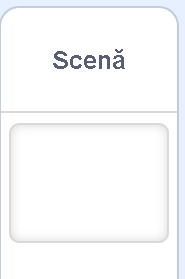
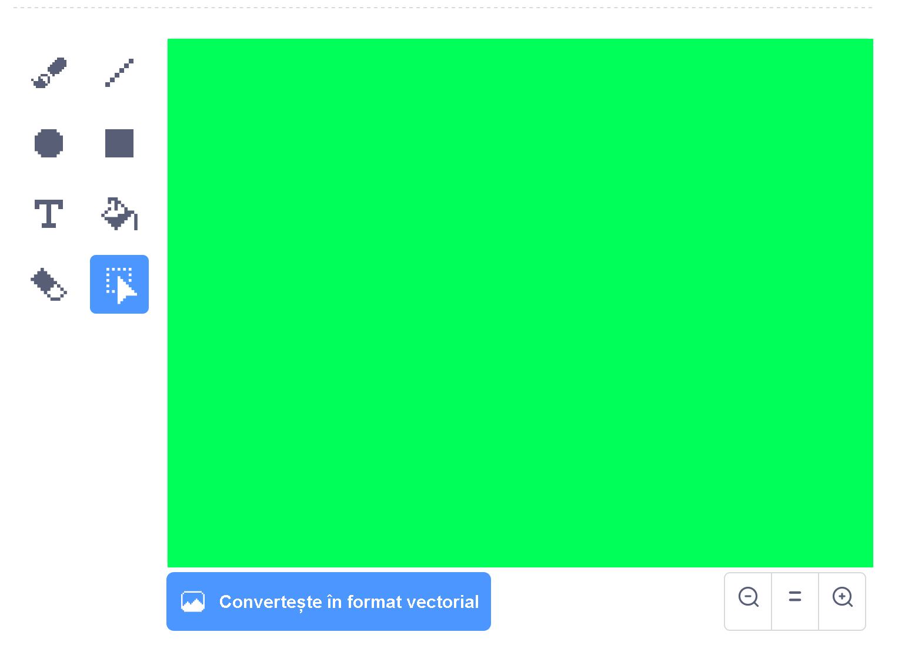
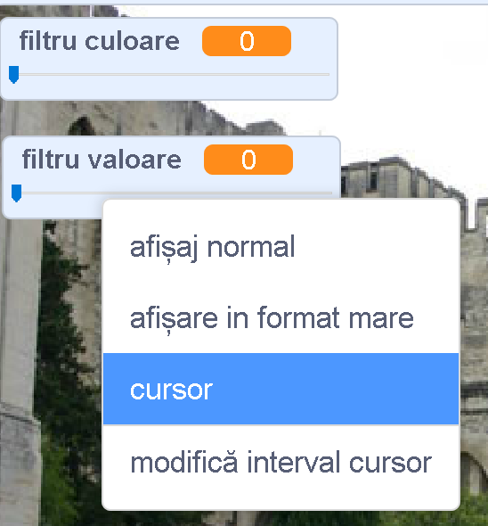

## Adaugă un filtru pentru culoare

Acum dă imaginii tale un filtru pentru culoare.

--- task ---

Dă click pe pictograma **Alege un decor**.



Folosește fila **Decoruri** pentru a **Converti în format vectorial**. Apoi folosește unealta **Umplere** pentru a umple fundalul cu o singură culoare.



--- /task ---

--- task ---

Apoi, creează două variabile numite `filtru culoare`{:class="block3variables"} și `filtru valoare`{:class="block3variables"}. Pe scenă poți da click dreapta pe aceste variabile și să le setezi pe amândouă ca fiind **cursoare**.



--- /task ---

--- task ---

Pentru a termina proiectul, folosește aceste variabile pentru a schimba aspectul filtrului.

```blocks3
when flag clicked
turn video (on v)
forever
set video transparency to (filtru valoare)
set [color v] effect to (filtru culoare)
```

--- /task ---

--- task ---

Acum poți muta cursoarele pentru a vedea efectul asupra imaginii tale.

--- /task ---


