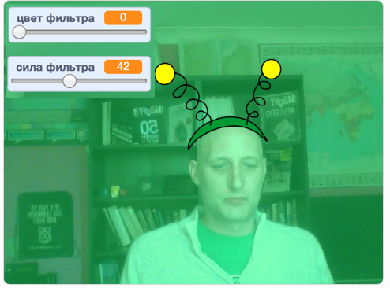

## Введение

Ты сделаешь проект, который добавит фильтры и забавные костюмы к твоему изображению на экране.

### Что ты сделаешь

--- no-print ---

Используй клавиши со стрелками, чтобы изменить размер твоего костюма, и рычажки, чтобы изменить эффект фильтра. <iframe src="https://scratch.mit.edu/projects/381995604/embed" allowtransparency="true" width="485" height="402" frameborder="0" scrolling="no" allowfullscreen mark="crwd-mark"></iframe>

--- /no-print ---

--- print-only ---

--- /print-only ---

--- collapse ---
---
title: Что тебе понадобится
---

### Оборудование

+ Компьютер с веб-камерой

### Программное обеспечение

+ Scratch 3.0 ([онлайн](http://rpf.io/scratchon) или [автономный (offline)](http://rpf.io/scratchoff))

--- /collapse ---

--- collapse ---
---
title: Чему ты научишься
---

- Как снимать видео в Scratch
- Как изменять цветовые эффекты
- Как сменять костюмы с помощью клавиш

--- /collapse ---

--- collapse ---
---
title: Дополнительная информация для педагогов
---

Если вы хотите напечатать этот проект, то воспользуйтесь [версией для печати](https://projects.raspberrypi.org/en/projects/scratchchat-filters/print){:target="_blank"}.

--- /collapse ---
