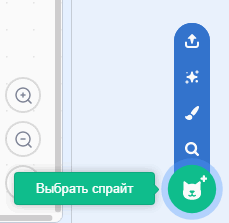

## Подготавливаем сцену

--- task ---

Открой новый проект Scratch.

**Онлайн:** открой новый онлайн проект Scratch по адресу [rpf.io/scratch-new](https://rpf.io/scratch-new).

**Офлайн:** открой новый проект в автономном редакторе.

Если тебе необходимо скачать и установить оффлайн редактор Scratch, то ты можешь найти его по адресу [rpf.io/scratchoff](https://rpf.io/scratchoff).

--- /task ---

--- task ---

Чтобы начать новый проект, тебе нужен спрайт. Ты будешь использовать спрайт, чтобы украсить свой образ. Нажми на иконку **Корзина**, чтобы удалить текущий спрайт кота.

--- /task ---

--- task ---

Создай новый спрайт, нажав на иконку **Выберите спрайт**.

--- /task ---

--- task ---

Нажми кнопку **Мода** и выбери один из спрайтов. Здесь мы начнем с очков.

--- /task ---

--- task ---

Нажми кнопку **Добавить расширение** в левом нижнем углу.

--- /task ---

--- task ---

Выбери дополнение **Видео распознавание** из предоставленного меню.

--- /task ---

--- task ---

Если твой веб-браузер запрашивает, то **Разреши** доступ к своей веб-камере.

--- /task ---

--- task ---

Теперь ты можешь увидеть себя на сцене и ты можешь поместить очки на лицо.

--- /task ---

