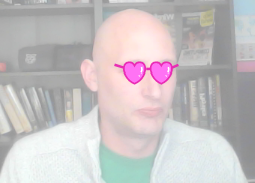

## Как поменять костюмы

--- task ---

Теперь, когда твои очки расположены на месте, ты можешь использовать несколько простых нажатий клавиш, чтобы изменить их стиль. Добавь эти блоки кода в свой спрайт.

```blocks3
when [right arrow v] key pressed
next costume
```

--- /task ---

--- task ---

Попробуй нажать клавишу со стрелкой вправо на клавиатуре, чтобы увидеть, как очки меняют стиль.



--- /task ---

--- task ---

Ты также можешь вернуться к предыдущему костюму, используя клавишу со стрелкой влево. Для этого тебе нужно использовать `номер костюма`{:class="block3looks"} и вычесть из него `1`.

```blocks3
when [left arrow v] key pressed
switch costume to ((costume [number v]) - (1))
```

--- /task ---

--- task ---

Чтобы добавить еще несколько костюмов в свой спрайт, перейди на вкладку **Костюмы**, а затем нажми кнопку **Выбрать Костюм** в нижнем левом углу экрана.


--- /task ---

--- task ---

На вкладке **Костюмы** ты можешь выбрать все части костюма, удерживая клавишу Ctrl на клавиатуре, а затем нажав на клавишу буква А в английской раскладке. Затем ты можешь переместить и изменить размеры каждого костюма, чтобы он был в нужном месте.


--- /task ---

--- task ---

Теперь ты можешь использовать клавиши со стрелками, чтобы перебрать все свои разнообразные костюмы.


--- /task ---

