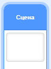
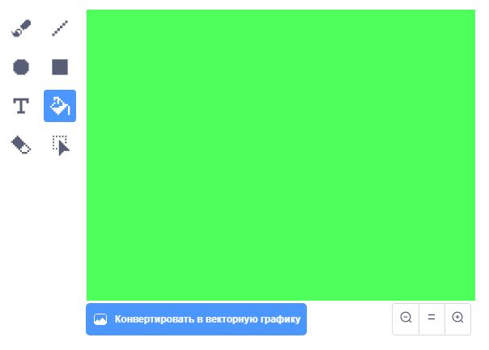
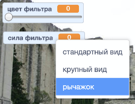

## Добавляем цветовой фильтр

Теперь дай своему изображению цветовой фильтр.

--- task ---

Нажми на иконку **Фон**.



Используй вкладку **Фон** для **Конвертирования в растровую графику**. Затем используй инструмент **Заливка** для заливки фона одним цветом.



--- /task ---

--- task ---

Далее создай две переменные под названием `цвет фильтра`{:class="block3variables"} и `сила фильтра`{:class="block3variables"}. На сцене ты можешь щелкнуть правой кнопкой мыши по этим переменным и установить их как **рычажки**.



--- /task ---

--- task ---

Чтобы завершить проект, используй эти переменные для изменения внешнего вида.

```blocks3
when flag clicked
turn video (on v)
forever
set video transparency to (Количество цвета)
set [color v] effect to (Фильтр цвета)
```

--- /task ---

--- task ---

Теперь ты можешь перемещать рычажки, чтобы увидеть эффект на своём изображении.

--- /task ---


