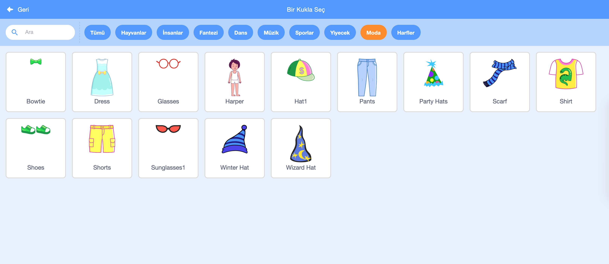

## Sahneyi ayarlayın

--- task ---

Yeni bir Scratch projesi açın.

**Çevrimiçi:** [rpf.io/scratch-new](https://rpf.io/scratch-new) adresinden yeni bir çevrimiçi Scratch projesi açın.

**Çevrimdışı:** çevrimdışı düzenleyicide yeni bir proje açın.

Eğer Scratch çevrimdışı düzenleyicisini indirip yüklemeniz gerekiyorsa, [rpf.io/scratchoff](https://rpf.io/scratchoff) adresinde yükleme dosyasını bulabilirsiniz.

--- /task ---

--- task ---

Yeni projenize başlamak için bir Sprite'a ihtiyacınız var. Sprite'ı kendi görüntünüzü süslemek için kullanacaksınız. Geçerli kedi Sprite'ını silmek için **Çöp Kutusu** simgesini tıklayın.

--- /task ---

--- task ---

**Bir Sprite Seçin** simgesine tıklayarak yeni bir Sprite oluşturun.

--- /task ---

--- task ---

**Moda** düğmesini seçin ve Spritelardan birini seçin. Burada gözlüklerle başlayacağız.

--- /task ---

--- /task ---

Ekranın sol alt köşesindeki **Uzantı Ekle** düğmesine tıklayın.

--- /task ---

--- /task ---

Verilen menüden **Video Algılama** eklentisini seçin.

--- /task ---

--- /task ---

Web tarayıcınız tarafından web kameranıza erişim izni istenirse, **İzin Ver** düğmesine tıklayın.

--- /task ---

--- /task ---

Artık kendinizi sahnede görebilmeli ve gözlükleri yüzünüze yerleştirebilmelisiniz.

--- /task ---

