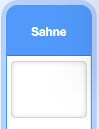
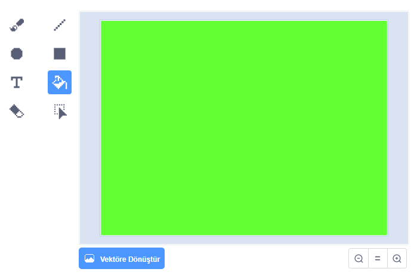
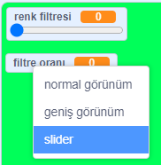

## Renk filtresi ekle

Şimdi resminize bir renk filtresi verin.

--- task ---

**Zemin** ikonuna tıklayın.



**Zeminler** sekmesinden **Bitmap'e Dönüştür** butonuna tıklayın. **Boya Kovası** aracını zemini tek bir renk ile doldurmak için kullanın.



--- /task ---

--- task ---

Sonrasında, `renk filtresi`{:class="block3variables"} ve `filtre oranı`{:class="block3variables"} isminde iki adet değişken tanımlayın. Sahne üzerinde bu değişkenlere sağ tıklayarak ikisinin de birer **kaydırıcı** türünde olmasını sağlayabilirsiniz.



--- /task ---

--- task ---

Projeyi bitirmek için, tanımladığınız bu değişkenleri kullanarak filtrenin görünümünü değiştirin.

```blocks3
when flag clicked
turn video (on v)
forever
set video transparency to (filtre oranı)
set [color v] effect to (renk filtresi)
```

--- /task ---

--- task ---

Şimdi kaydırıcıların hareket ettirerek efektin resminiz üzerindeki etkisini görebilirsiniz.

--- /task ---


