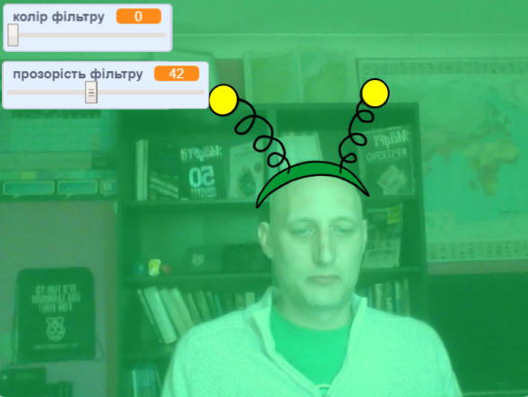

## Вступ

Ти зробиш проєкт, щоб додавати фільтри та смішні костюми до свого зображення на екрані.

### Що ти зробиш

--- no-print ---

Використовуй клавіші зі стрілками для зміни розміру свого костюма, а повзунки — для зміни ефекту фільтра. <iframe src="https://scratch.mit.edu/projects/384708492/embed" allowtransparency="true" width="485" height="402" frameborder="0" scrolling="no" allowfullscreen mark="crwd-mark"></iframe>

--- /no-print ---

--- print-only ---

--- /print-only ---

--- collapse ---
---
title: Що тобі знадобиться
---

### Обладнання

+ Комп'ютер з веб-камерою

### Програмне забезпечення

+ Скретч 3.0 ([онлайн](http://rpf.io/scratchon) або [офлайн](http://rpf.io/scratchoff))

--- /collapse ---

--- collapse ---
---
title: Чого ти навчишся
---

- Як записувати відео в Скретч
- Як змінювати кольорові ефекти
- Як змінювати образи за допомогою клавіш

--- /collapse ---

--- collapse ---
---
title: Додаткова інформація для викладачів
---

Якщо вам потрібно роздрукувати цей проєкт, будь ласка, скористайтеся [версією для друку](https://projects.raspberrypi.org/uk-UA/projects/scratchchat-filters/print){:target="_ blank"}.

--- /collapse ---
