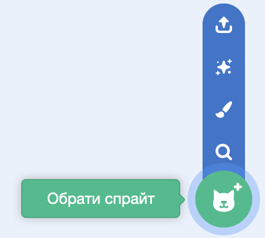

## Налаштуй сцену

--- task ---

Відкрий новий проєкт Скретч.

**Онлайн:** відкрий новий онлайн проєкт Скретч на [rpf.io/scratch-new](https://rpf.io/scratch-new).

**Офлайн:** відкрий новий проєкт в офлайн-редакторі.

Якщо тобі треба завантажити та встановити офлайн-редактор Скретч, то ти можеш його знайти на [rpf.io/scratchoff](https://rpf.io/scratchoff).

--- /task ---

--- task ---

Для початку роботи над новим проєктом тобі потрібен спрайт. Ти будеш використовувати спрайт для оформлення власного зображення. Клацни на іконку **Кошик**, щоб видалити наявний спрайт кота.

--- /task ---

--- task ---

Створи новий спрайт, натиснувши на значок **Обрати спрайт**.

--- /task ---

--- task ---

Натисни кнопку **Мода** і вибери один із спрайтів. В даному випадку ми розпочнемо із окулярів.

--- /task ---

--- task ---

Натисни кнопку **Додати розширення** у лівому нижньому куті екрана.

--- /task ---

--- task ---

Вибери розширення **Відеоспостереження** у меню.

--- /task ---

--- task ---

Якщо тебе запитає веббраузер, тоді **Дозволь** отримати доступ до своєї вебкамери.

--- /task ---

--- task ---

Тепер ти можеш побачити себе на сцені, і зможеш розташувати окуляри на своєму обличчі.

--- /task ---

