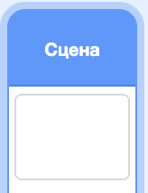
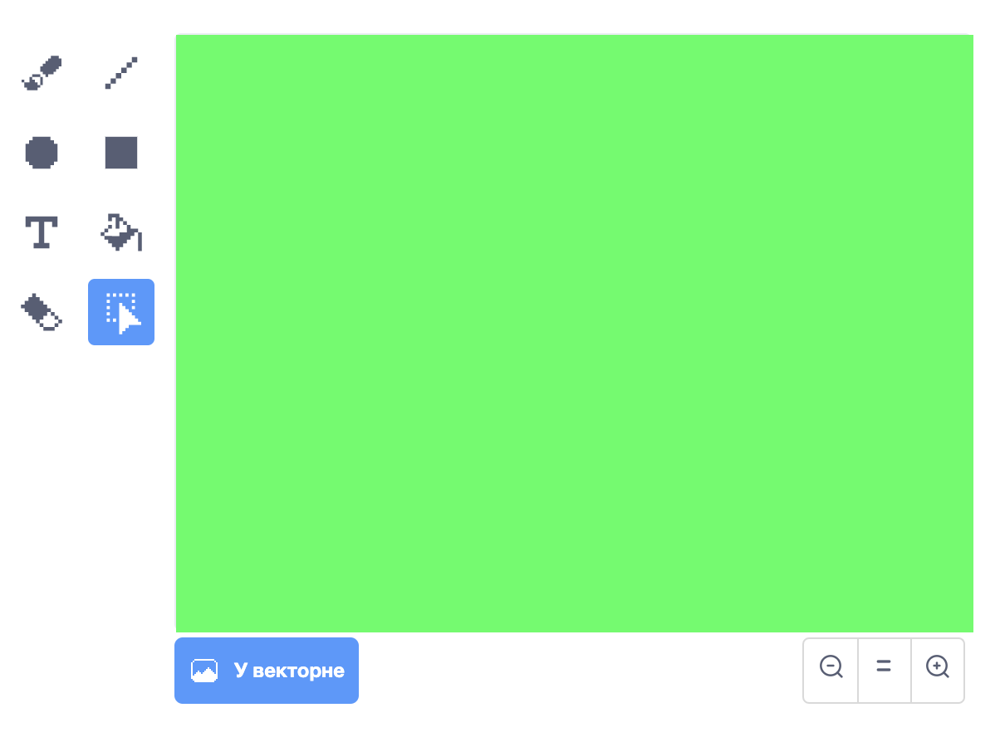
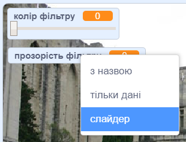

## Додай кольоровий фільтр

Тепер додай до свого зображення кольоровий фільтр.

--- task ---

Натисни на значок **Сцена**.



Використай вкладку **Тло**, щоб перевести зображення **У растрове**. Далі використовуй інструмент **Заповення**, щоб залити тло суцільним кольором.



--- /task ---

--- task ---

Потім створи дві змінні з іменами `колір фільтру`{:class="block3variables"} та `прозорість фільтру`{:class="block3variables"}. На сцені ти можеш клацнути правою клавішою мишки по цих змінних і перетворити їх на **слайдери**.



--- /task ---

--- task ---

Для завершення проєкту, використай ці змінні для зміни вигляду фільтра.

```blocks3
when flag clicked
turn video (on v)
forever
set video transparency to (filter amount)
set [color v] effect to (filter colour)
```

--- /task ---

--- task ---

Тепер ти можеш рухати слайдери, щоб бачити ефект на своєму зображенні.

--- /task ---


