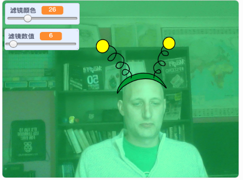

## 介绍

您将要创建一个项目，为自己的视频图像添加滤镜和瓜瓜的造型。

### 你将制作：

--- no-print ---

使用方向键更改造型的样子，使用滑块更改滤镜效果。 <iframe src="https://scratch.mit.edu/projects/381995604/embed" allowtransparency="true" width="485" height="402" frameborder="0" scrolling="no" allowfullscreen mark="crwd-mark"></iframe>

--- /no-print ---

--- print-only ---

--- /print-only ---

--- collapse ---
---
标题: 你需要准备什么
---

### 硬件部分

+ 带有摄像头的计算机

### 软件部分

+ Scratch 3.0 ([在线版本](http://rpf.io/scratchon)或[离线版本](http://rpf.io/scratchoff))

--- /collapse ---

--- collapse ---
---
标题: 你将学会什么
---

- 如何在 Scratch 中捕获视频
- 如何改变色彩效果
- 如何通过按键更换造型

--- /collapse ---

--- collapse ---
---
标题: 为教育者提供的额外信息
---

如果您需要打印本项目文件，请使用 [适合打印的版本](https://projects.raspberrypi.org/en/projects/scratchchat-filters/print){:target="_blank"}。

--- /collapse ---
