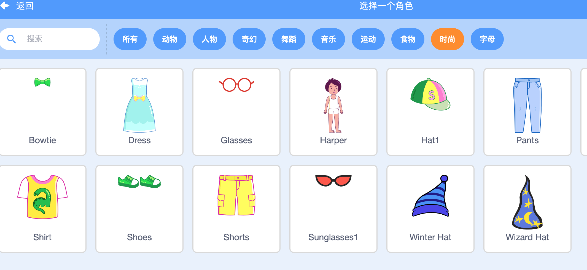
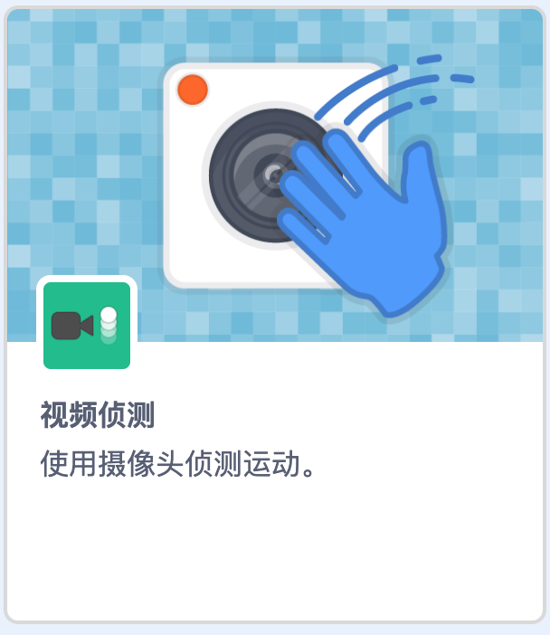

## 设置舞台

--- task ---

创建一个新的 Scratch 项目

**在线版本：** 在 [rpf.io/scratch-new](https://rpf.io/scratch-new) 上打开一个新的在线Scratch 项目。

**离线版本： ** 在离线编辑器中打开一个新项目。

如果您需要下载并安装 Scratch 离线编辑器，你可以在[rpf.io/scratchoff ](https://rpf.io/scratchoff) 中获取。

--- /task ---

--- task ---

要开始这个新项目，您需要一个精灵。 您将使用精灵来装饰自己的视频图像。 单击 **垃圾桶** 图标删除当前的猫咪精灵。

--- /task ---

--- task ---

通过单击 **选择一个角色** 图标创建一个新的精灵。

--- /task ---

--- task ---

选择 **时尚** 按钮，然后选择其中一个精灵。 我们会从眼镜开始。

--- /task ---

--- task ---

单击屏幕左下角的 **添加扩展** 按钮。

--- /task ---

--- task ---

从提供的菜单中选择 **视频侦测** 扩展库。

--- /task ---

--- task ---

如果您的浏览器提示您，则 **允许** 它访问您的摄像头。

--- /task ---

--- task ---

现在，您应该可以在舞台上看到自己了，并且可以将眼镜放在脸上。

--- /task ---

