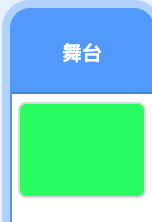
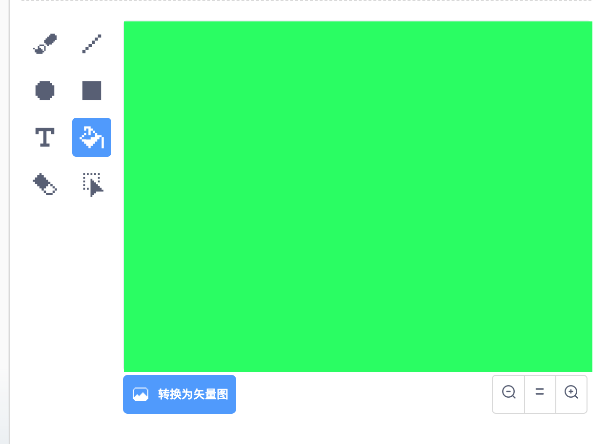
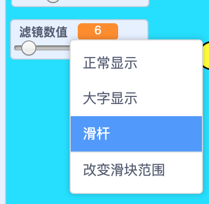

## 添加滤镜

现在给您的图像添加滤镜。

--- task ---

点击 **背景** 图标。



使用 **背景** 选项卡来 **转换为位图** 。 然后使用 **填充** 工具来用单色填充背景。



--- /task ---

--- task ---

接着创建两个变量，分别叫做 `滤镜颜色`{:class="block3variables"} 和 `滤镜数值`{:class="block3variables"} 在舞台上，您可以右键单击这些变量，并将它们都设置为 **滑块** 。



--- /task ---

--- task ---

要完成您的项目，请使用这些变量来更改滤镜的外观。

```blocks3
when flag clicked
turn video (on v)
forever
set video transparency to (filter amount)
set [color v] effect to (filter colour)
```

--- /task ---

--- task ---

现在，您可以移动滑块以查看图像上的效果。

--- /task ---


