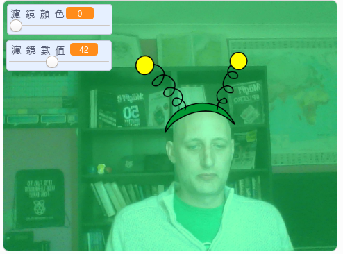

## 介紹

您將要建立一個專案，為螢幕上的圖像添加濾鏡和可愛的造型。

### 您將會製作出

--- no-print ---

使用方向鍵更改造型的樣子，使用滑動鍵更改濾鏡效果。 
<iframe src="https://scratch.mit.edu/projects/442620026/embed" allowtransparency="true" width="485" height="402" frameborder="0" scrolling="no" allowfullscreen mark="crwd-mark"></iframe>

--- /no-print ---

--- print-only ---

--- /print-only ---

--- collapse ---
---
title: 您會需要用到
---

### 硬體

+ 帶有攝影鏡頭的電腦

### 軟體

+ Scratch 3.0（[線上版](http://rpf.io/scratchon){:target="_blank"} 或 [離線版](http://rpf.io/scratchoff){:target="_blank"}）

--- /collapse ---

--- collapse ---
---
title: 您會學到什麼
---

- 如何在Scratch中擷取視頻
- 如何改變色彩效果
- 如何通過按鍵更換造型

--- /collapse ---

--- collapse ---
---
title: 給教師的額外資訊
---

如果您需要列印此專案內容，請下載 [列印友善版本](https://projects.raspberrypi.org/zh-TW/projects/scratchchat-filters/print){:target="_blank"}。

--- /collapse ---
