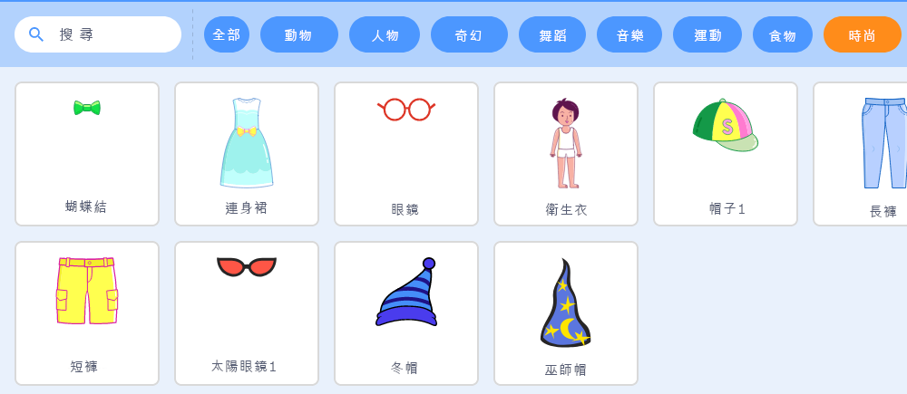
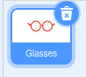
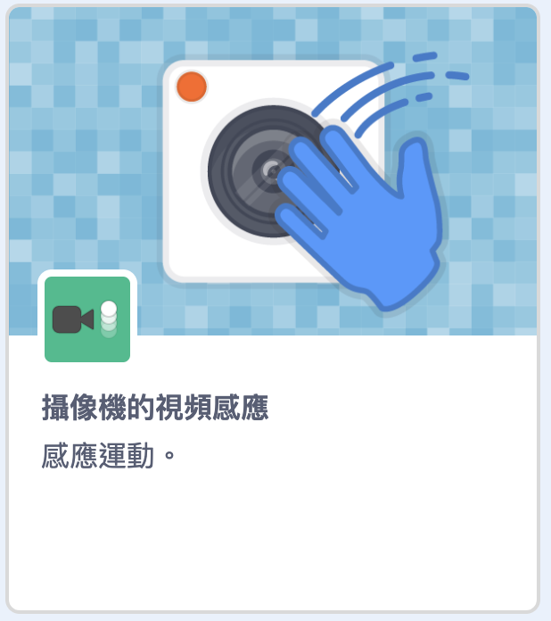
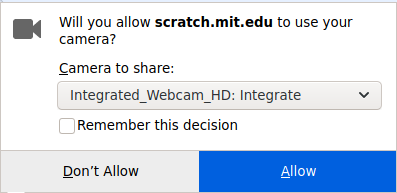

## 設置舞台

--- task ---

建立一個新的 Scratch 專案。

**在線版：** 在 [rpf.io/scratch-new](https://rpf.io/scratch-new)處打開一個新的在線Scratch專案。

**離線版：**在離線編輯器的工作列中開啟選單並點擊新建專案。

如果你需要下載並安裝 Scratch 離線版編輯器，可以到 [rpf.io/scratchoff](https://rpf.io/scratchoff){:target="_blank"}取得。

--- /task ---

--- task ---

要開始新專案，您需要一個精靈。 您將使用精靈來裝飾自己的形象。 點擊 **垃圾桶** 圖標來刪除當前的貓咪精靈。

--- /task ---

--- task ---

通過單擊 **選擇一個精靈** 圖標創建一個新的精靈。

--- /task ---

--- task ---

選擇 **時尚** 按鈕，然後選擇其中一個精靈。 我們將從眼鏡開始。

--- /task ---

--- task ---

點擊螢幕左下角的**添加擴展**按鈕。

--- /task ---

--- task ---

從提供的目錄中選擇 **影像感應** 插件。

--- /task ---

--- task ---

如果您的瀏覽器提示您，則 **允許** 它訪問您的網絡攝像頭。

--- /task ---

--- task ---

現在，您應該可以在舞台上看到自己了，並且可以將眼鏡放在臉上。

--- /task ---

