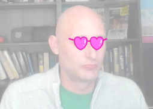

## 如何更換造型

--- task ---

現在您已經放置好眼鏡，可以使用一些簡單的按鍵來更改其樣式。 將這些代碼塊添加到您的精靈中。

```blocks3
當[右箭頭v]鍵按下
下一個造型
```

--- /task ---

--- task ---

嘗試按鍵盤上的右箭頭鍵，以查看眼鏡的樣式變化。



--- /task ---

--- task ---

您可能還想使用左箭頭鍵恢復到之前的造型。 為此，您需要使用 `造型編號`{:class="block3looks"}，然後從中減去 `1`。

```blocks3
when [left arrow v] key pressed
switch costume to ((costume [number v]) - (1))
```

--- /task ---

--- task ---

要將更多造型添加到精靈中，請點擊 **造型** 選項卡，然後點擊螢幕左下角的 **選擇一個造型** 按鈕。


--- /task ---

--- task ---

在“ **造型** 選項卡中，您可以通過按住鍵盤上的Ctrl＋A鍵來選擇造型的所有部分。 然後，您可以移動每個造型並調整其大小，以便將它們放在正確的位置上。


--- /task ---

--- task ---

現在，您可以使用方向鍵在所有不同的造型中循環。


--- /task ---

