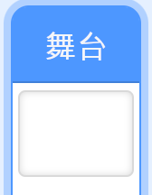
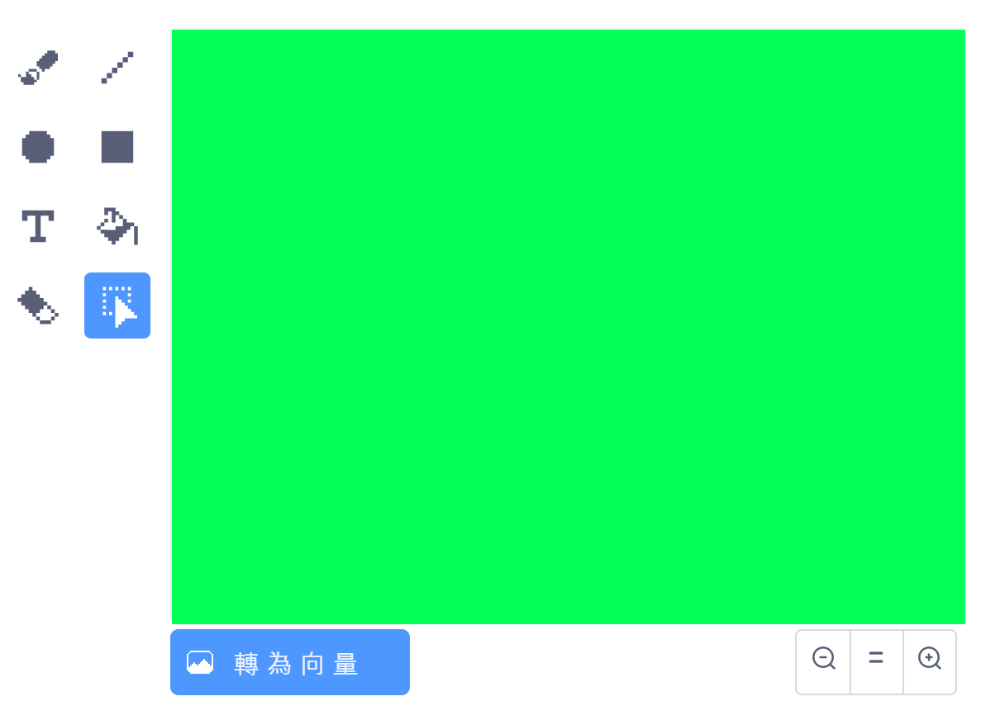
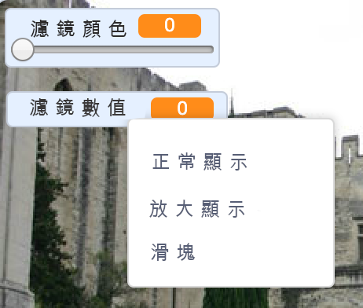

## 添加顏色濾鏡

現在給你的圖像一個顏色濾鏡。

--- task ---

點擊 **背景** 圖標。



使用**背景**選項來轉換成**位圖Bitmap** 。 然後使用** 填充**工具來用單色填滿背景。



--- /task ---

--- task ---

接下來創建兩個變量，分别叫做 `濾鏡顏色`{:class="block3variables"} 和 `濾鏡數值`{:class="block3variables"} 在舞台上，您可以在變量上點擊右鍵，並將他們都設置為**滑動鍵** 。



--- /task ---

--- task ---

要完成您的項目，請使用這些變量來更改濾鏡的外觀。

```blocks3
when flag clicked
turn video (on v)
forever
set video transparency to (filter amount)
set [color v] effect to (filter colour)
```

--- /task ---

--- task ---

現在您可以移動滑動鍵來查看圖像上的效果。

--- /task ---


